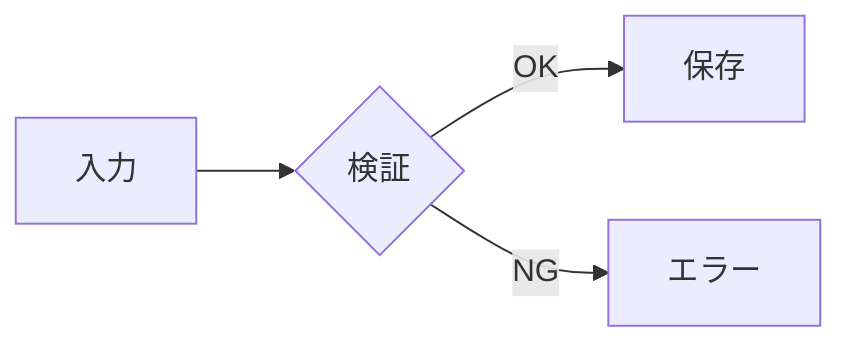

# レポート本文の記法

`New-HtmlReport.ps1` に渡す Markdown で使える記法の一覧。

汎用 Markdown パーサではなく、レポートに必要な記法だけを扱う。ここに無い記法は段落として素通しされるので、内容が消えることはないが装飾も付かない。

## 見出し

```markdown
## セクション名
### 小見出し
```

`##` がセクションカード（色付きヘッダー + 枠）になる。レポートの構造は `##` で決まるので、これを骨組みとして書く。

`#` は使わない。レポートタイトルは `-Title` パラメータで渡す。

## 表

```markdown
| 箇所 | 問題 | 対応 |
|---|---|---|
| `auth.ts:42` | SQLインジェクション | パラメータ化 |
```

データ行が 15 を超えると、16 行目以降は自動で折りたたまれる。行数を気にせず全件書いてよい。

セル数がヘッダーに足りない行は空セルで埋められるので、列がずれることはない。

## 重要度バッジ

```markdown
[!red 重大]  [!yellow 中]  [!green 対応済]  [!blue 情報]  [!gray 保留]
```

表のセル内でも段落中でも使える。重要度や状態を一目で分からせたいときに使う。

## コードブロック

````markdown
```typescript
await redis.set(key, value);
```
````

言語名は任意。付けると `data-lang` 属性に入る。

## 図

### Mermaid

````markdown

````

フロー図・シーケンス図・ER 図・状態遷移図・ガントチャートなど。Mermaid ブロックが 1 つでもあると、生成時に描画スクリプト（CDN）が自動で埋め込まれる。

**注意**: CDN 依存のため、オフラインで開くと図が表示されない。後から見返す可能性が高いレポートで確実に図を残したい場合は SVG を使う。

### インライン SVG

````markdown
```svg
<svg viewBox="0 0 400 100" xmlns="http://www.w3.org/2000/svg">
  <rect x="10" y="30" width="100" height="40" rx="6" fill="#dbeafe"/>
  <text x="60" y="55" text-anchor="middle" font-size="13">Client</text>
</svg>
```
````

そのまま埋め込まれる。依存が無いので何年後でも同じ見た目で開ける。任意の配置が要る図や、確実に残したい図に使う。

`viewBox` を付けると幅に追従する。

`<script>` や `onload=` のような実行される部分は埋め込み時に除去される。レポート本文には調査対象から引用したコードが入ることがあり、それを開いただけで実行されると困るため。図の描画に必要な要素は残る。

## 進捗バー

```markdown
:::bar 認証エンドポイント|85
:::bar セッション更新|40
```

`ラベル|パーセント` 形式。カバレッジ、影響範囲、進捗率など割合を示すときに使う。値は 0〜100 に丸められる。

## 引用

```markdown
> 発生頻度: 全リクエストの約 3%
> 影響: ログイン直後のみ
```

前提条件やログの抜粋など、本文から浮かせたい情報に使う。

## リスト

```markdown
- 箇条書き
  - インデントすると入れ子になる
1. 番号付き
```

インデント幅は 2 でも 4 でもよく、同じ深さのものが同じ階層になる。箇条書きと番号付きが隣り合うと別のリストとして扱われる。

## 行内記法

```markdown
**強調**  *斜体*  `コード`  [ラベル](https://example.com)
```

リンクは `http:` `https:` `mailto:` `#` `/` `.` で始まるもののみ有効。それ以外はラベルだけが残る。

## 書くときの指針

セクションの粒度は 3〜6 個が読みやすい。多すぎると一覧性が落ち、少なすぎるとカードの意味がなくなる。

表とバッジは相性が良い。指摘一覧のような「項目 × 属性」の情報は、段落で書くより表にしたほうが圧倒的に速く読める。

図は、文章で説明すると 3 文以上かかる関係性がある場合に入れる。装飾目的では入れない。
